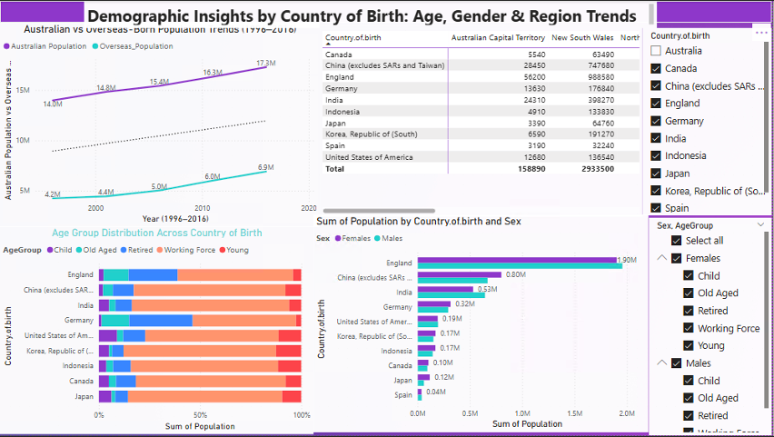
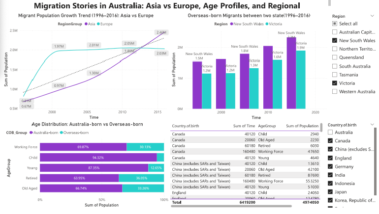

# 📊 Abhishek Mishra – Data Analytics Portfolio

<h3>📊 Project 1: Migration Trends in Australia (1996–2016)</h3>

  
<strong>📄 Read More: Full Report & Dashboard Analysis</strong>

  
<strong>Course:</strong> BUSA8031 – Data Visualization for Business 
  <strong>Tools Used:</strong> Power BI, Microsoft Excel, ABS CSV datasets 
  <strong>Skills Applied:</strong> Dashboard design, demographic storytelling, slicers & filters, regional comparison

  
This project visualizes Australia's population and migration patterns over 20 years using interactive Power BI dashboards. It explores state-wise population distribution, migrant source regions, workforce age profiles, and settlement patterns.

  <ul>
    <li>Dashboard 1: Population trends by region, gender, and age using slicers</li>
    <li>Dashboard 2: Migrant demographics and countries of origin</li>
    <li>Dashboard 3: Regional settlement comparisons and age profiles</li>
  </ul>

  
<strong>🖼️ Dashboard Preview:</strong>

  
  
<strong>Dashboard 1:</strong>

  
  
  
<strong>Dashboard 2:</strong>

  

  
<strong>Dashboard 3:</strong>

  

This dashboard shows how population numbers changed in different states of Australia between 1996 and 2016.

  
<strong>Key Highlights:</strong> 
  - NSW and Victoria are the most populated states, consistently growing due to better career options and urban appeal. 
  - Slicers enabled comparison between states by age and gender. 
  - Age distribution shows high working-age presence in VIC and NSW.

